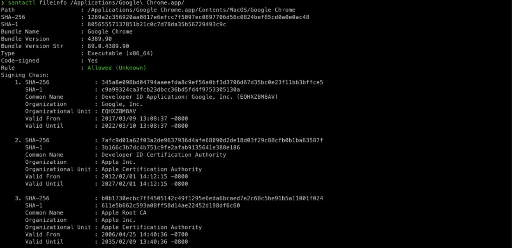

# Composition of a “Rule”
Santa uses rules stored in the rules database to make decisions. Each rule is composed of:

Shasum — The sha256 hash value to examine

## State — Whether or not a binary matching this rule is Allowed or Blocked
* 1 = ALLOWLIST
* 2 = BLOCKLIST
* 3 = SILENT_BLOCKLIST
* 4 = REMOVE
* 5 = ALLOWLIST_COMPILER
* 6 = ALLOWLIST_TRANSITIVE

## Type — What the shasum points to; either a binary or a certificate
* 1 = BINARY → The shasum is a hash of a binary file
* 2 = CERTIFICATE → The shasum is a hash of the code-signing certificate leaf (the first certificate or Apple developer certificate as used by Gatekeeper)
Custom Message — A custom message that is displayed to the end user whenever this specific rule triggers a deny

Whenever a new binary is executed, Santa’s system extension gathers information about the binary (via processes similar to `santactl fileinfo {BINARY}`) and looks up any relevant rules. It combines the rules to determine if a binary/application should be allowed/blocked to execute.

A sample output is provided below:

## Rules Database
The rules database is a db file, located at /var/db/santa/rules.db. It contains a database of all rules.